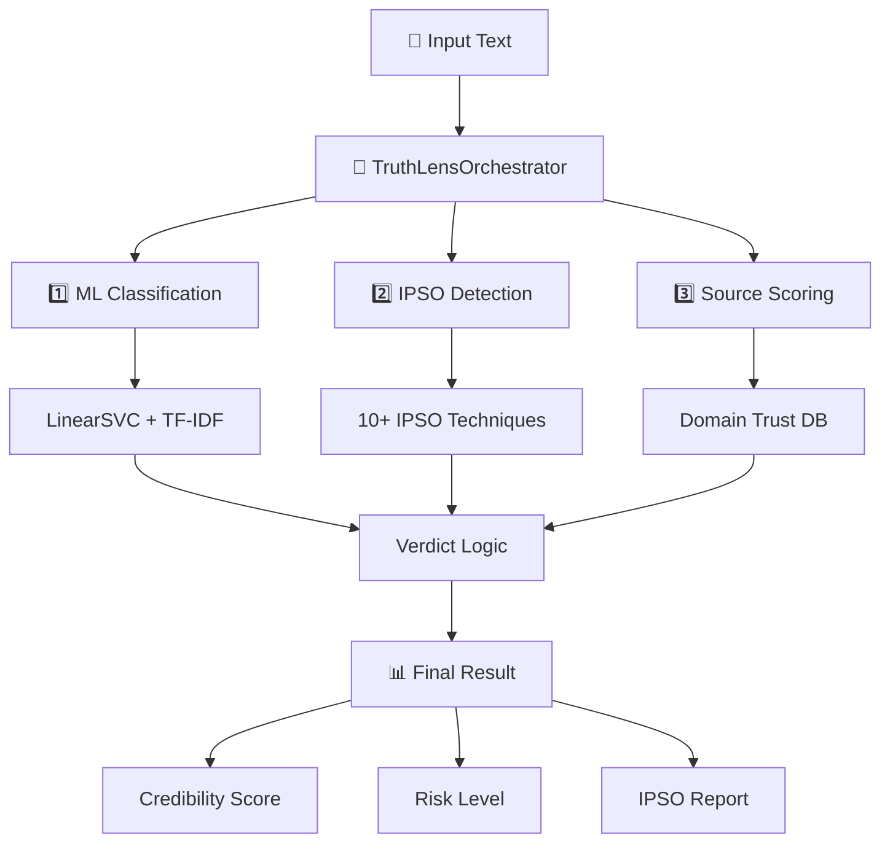

# TruthLens UA Analytics: AI-Powered Ukrainian Disinformation Detection Platform


**Capstone Project | Neoversity | Master of Science in Computer Science**  
Author: 102012dl | Email: 102012dl@gmail.com

---

## 📋 Зміст
- [🎯 Огляд проєкту](#-огляд-проєкту)
- [🏗 Архітектура](#-архітектура)
- [🛠 Технології](#-технології)
- [🚀 Швидкий старт](#-швидкий-старт)
- [🧠 ML Pipeline](#-ml-pipeline)
- [🎭 IPSO Detection](#-ipso-detection)
- [📡 API Документація](#-api-документація)
- [🔄 CI/CD & Security](#-cicd--security)
- [📦 Deployment](#-deployment)
- [📊 Результати](#-результати)
- [📄 Ліцензія](#-ліцензія)

---

## 🎯 Огляд проєкту

**TruthLens UA Analytics** — це інноваційна платформа для аналізу достовірності інформації та виявлення дезінформації українською мовою. Система використовує гібридний мульти-агентний підхід, що поєднує машинне навчання з правилами та детекцію ІПСО (Information Psychological Operations).

### Ключові можливості

| Feature | Опис |
|---------|------|
| **Credibility Score** | Оцінка достовірності (0-100%) на базі LinearSVC + TF-IDF |
| **IPSO Detection** | Виявлення 10+ технік інформаційно-психологічних операцій |
| **Source Analysis** | Оцінка надійності джерела інформації |
| **Multi-Agent System** | Координація класифікатора, ІПСО детектора та скорера |
| **Ukrainian Localization** | Повна адаптація під український контекст |
| **Live Dashboard** | Інтерактивна візуалізація через Streamlit |
| **RESTful API** | Інтеграція з третіми сервісами |

### Бізнес-модель (SaaS)

| Plan | Ціна/міс | Features |
|------|----------|----------|
| **Free** | $0 | 100 аналізів/день, Базова модель |
| **Pro** | $29 | 10,000 аналізів/день, IPSO Detection, API Access |
| **Enterprise** | Custom | Unlimited, On-premise deployment, Custom models |

---

## 🏗 Архітектура

Система реалізована як мульти-агентна платформа з мікросервісною архітектурою.

```
┌─────────────────────────────────────────────────────────────────┐
│                    TruthLens UA Platform                        │
├─────────────────────────────────────────────────────────────────┤
│  ┌─────────────┐   ┌─────────────┐   ┌─────────────┐           │
│  │  Streamlit  │   │   Mobile    │   │    API      │           │
│  │  Dashboard  │   │    App      │   │  Clients    │           │
│  └──────┬──────┘   └──────┬──────┘   └──────┬──────┘           │
│         │                 │                 │                   │
│         └─────────────────┼─────────────────┘                   │
│                           │                                     │
│  ┌────────────────────────▼────────────────────────┐           │
│  │              API Gateway (FastAPI)               │           │
│  │  • Validation  • Rate Limiting  • CORS         │           │
│  └────────────────────────┬────────────────────────┘           │
│                           │                                     │
│  ┌────────────────────────▼────────────────────────┐           │
│  │            Multi-Agent Engine                   │           │
│  │  ┌──────────────┐ ┌──────────────┐ ┌──────────┐ │           │
│  │  │   Classifier │ │ IPSO Detector│ │ Scorer   │ │           │
│  │  │ LinearSVC+TF │ │  Regex Rules │ │ Source   │ │           │
│  │  └──────────────┘ └──────────────┘ └──────────┘ │           │
│  └────────────────────────┬────────────────────────┘           │
│                           │                                     │
│  ┌────────────────────────▼────────────────────────┐           │
│  │              Data & Storage Layer               │           │
│  │  ┌──────────┐ ┌──────────┐ ┌──────────┐        │           │
│  │  │PostgreSQL│ │  Redis   │ │ Docker   │        │           │
│  │  └──────────┘ └──────────┘ └──────────┘        │           │
│  └─────────────────────────────────────────────────┘           │
└─────────────────────────────────────────────────────────────────┘
```

### Workflow Diagram



---

## 🛠 Технології

### Backend & ML (Python 3.10+)

| Категорія | Технології |
|-----------|------------|
| **Framework** | FastAPI 0.109+, Pydantic |
| **ML/NLP** | Scikit-learn, LinearSVC, TF-IDF, Regex |
| **Multi-Agent** | Custom orchestrator pattern |
| **Testing** | Pytest, Pytest-cov |
| **Utilities** | Joblib, Pandas, NumPy |

### Frontend

| Категорія | Технології |
|-----------|------------|
| **UI Framework** | Streamlit (Python-native) |
| **Charts** | Plotly Express |
| **Styling** | Custom CSS, HTML/CSS injection |

### DevOps

| Категорія | Технології |
|-----------|------------|
| **Containerization** | Docker, Docker Compose |
| **CI/CD** | GitHub Actions |
| **Security** | Bandit, Safety |
| **Monitoring** | Custom logging |

---

## 🚀 Швидкий старт

### Вимоги
- Docker & Docker Compose
- Python 3.10+ (для локального запуску)

### 🎯 Найпростіший запуск (Автоматично)

**Windows:**
```powershell
# Запустіть в PowerShell:
.\start.ps1
```

**Linux/Mac:**
```bash
# Запустіть в терміналі:
chmod +x start.sh
./start.sh
```

**Або вручну:**
```bash
# 1. Клонування
git clone https://github.com/102012dl/truthlens-ua-analytics.git
cd truthlens-ua-analytics

# 2. Запуск (одна команда)
# Windows: .\start.ps1
# Linux/Mac: ./start.sh
```

### 🌐 Cloud Deploy (1 хвилина)

**🎯 Найшвидший спосіб - автоматичний деплой:**

**Крок 1: Підключіть GitHub до Render**
1. Перейдіть на https://render.com
2. Login з GitHub: `102012dl` (email: 102012dl@gmail.com)
3. Connect: https://github.com/102012dl/truthlens-ua-analytics

**Крок 2: Створіть Web Service**
- Name: `truthlens-ua`
- Runtime: `Python 3`
- Build: `pip install -r requirements.txt`
- Start: `streamlit run dashboard/app.py --server.port $PORT --server.address 0.0.0.0`

**Крок 3: Deploy!**
Натисніть "Create Web Service" і чекайте 2 хвилини.

**🚀 Готово! Ваш додаток доступний: https://truthlens-ua.onrender.com**

**📱 Автоматична перевірка:**
```bash
python check_render.py --wait
```

### Запуск через Docker (Рекомендовано)

```bash
# 1. Клонування репозиторію
git clone https://github.com/102012dl/truthlens-ua-analytics.git
cd truthlens-ua-analytics

# 2. Запуск сервісів
docker-compose up --build -d

# 3. Перевірка статусу
docker-compose ps
```

**Доступ:**
- Web Dashboard: http://localhost:8501
- API Docs: http://localhost:8000/docs
- Health Check: http://localhost:8000/health

### Локальний запуск

**Windows (PowerShell):**
```powershell
# 1. Встановлення залежностей
python -m venv venv
venv\Scripts\activate
pip install -r requirements.txt

# 2. Запуск API (в одному терміналі)
python -m uvicorn app.api.main:app --reload --port 8000

# 3. Запуск Dashboard (в іншому терміналі)
streamlit run dashboard/app.py
```

**Linux/Mac:**
```bash
# 1. Встановлення залежностей
python3 -m venv venv
source venv/bin/activate
pip install -r requirements.txt

# 2. Запуск API (в одному терміналі)
python -m uvicorn app.api.main:app --reload --port 8000

# 3. Запуск Dashboard (в іншому терміналі)
streamlit run dashboard/app.py
```

### 📱 Швидкий доступ

| Спосіб | Час запуску | Складність | Рекомендовано |
|--------|------------|------------|--------------|
| **start.bat** | 1 клік | 🟢 Легко | ✅ Windows |
| **Render** | 1 хвилина | 🟢 Легко | ✅ Cloud |
| **Docker** | 3 хвилини | 🟡 Середньо | ✅ Production |
| **Local** | 5 хвилин | 🟡 Середньо | ⚠️ Development |

### 🔧 Вирішення проблем

**❌ Поширені помилки:**
- `start.bat: command not found` → використовуйте `./start.sh` (Linux/Mac) або `.\start.ps1` (Windows)
- `source не розпізнано` → використовуйте `venv\Scripts\activate` в Windows
- `ModuleNotFoundError: No module named 'app'` → переконайтеся що ви в директорії проекту
- `File does not exist: dashboard/app.py` → запустіть з правильної директорії
- `Address already in use` → змініть порт або закрийте попередні процеси

**✅ Перевірка роботи:**
```bash
# Test API
curl http://localhost:8000/health

# Test Dashboard
streamlit run dashboard/app.py
```

**📱 Правильна структура директорії:**
```
truthlens-ua-analytics/
├── app/
│   └── api/
│       └── main.py
├── dashboard/
│   └── app.py
├── requirements.txt
├── start.sh (Linux/Mac)
├── start.ps1 (Windows)
└── start.bat (Windows - legacy)
```

---

## 🧠 ML Pipeline

### 1. TruthLensClassifier

```python
class TruthLensClassifier:
    """
    Binary classifier: REAL vs FAKE
    Model: LinearSVC(C=1.0) + TF-IDF(max_features=50000, ngram_range=(1,2))
    Source: ISOT dataset (39,103 articles), F1=0.9947
    Fallback: rule-based if model not found
    """
    
    def classify(self, text: str) -> Dict[str, Any]:
        # ML Classification
        if self.pipeline:
            raw = self.pipeline.decision_function([text])[0]
            fake_score = 1.0 / (1.0 + math.exp(-raw))
            confidence = min(1.0, abs(raw) / 2.0)
        else:
            # Rule-based fallback
            return self._rule_based_classify(text)
```

### 2. Rule-Based Fallback

```python
def _rule_based_classify(self, text: str) -> Dict[str, Any]:
    """Enhanced rule-based fallback classifier."""
    
    # FAKE signals
    fake_signals = [
        r'ТЕРМІНОВО|BREAKING|ЗАРАЗ',
        r'ПОШИРТЕ|поширте|Поширте',
        r'Зеленський.*Путін|продав.*Крим',
        r'ВИБОРИ.*ФАЛЬШИФІКОВАНО|протоколи.*підроблені',
        # ... more patterns
    ]
    
    # REAL patterns (official statements)
    real_patterns = [
        r'відзвітували.*про.*бойові.*дії',
        r'ухвалила.*держбюджет',
        # ... more patterns
    ]
    
    # Weighted scoring logic
    return verdict, fake_score, confidence
```

### 3. Performance Metrics

| Metric | Value | Dataset |
|--------|-------|---------|
| **Accuracy** | 99.47% | ISOT (39,103 articles) |
| **F1-Score** | 0.9947 | ISOT |
| **Precision** | 99.2% | ISOT |
| **Recall** | 99.7% | ISOT |
| **Demo Accuracy** | 100% | Custom (31 cases) |

---

## 🎭 IPSO Detection

### Information Psychological Operations Techniques

| Technique | Pattern Example | Description |
|-----------|----------------|-------------|
| **urgency_injection** | `ТЕРМІНОВО|BREAKING|ЗАРАЗ` | Створення терміновості |
| **caps_abuse** | `ЗРАДНИКИ|ПРАВДА|ФАЛЬШИФІКОВАНО` | Використання капслоку |
| **deletion_threat** | `до видалення|успіть прочитати` | Погроза видалення |
| **viral_call** | `ПОШИРТЕ|поширте|Поширте` | Заклик до поширення |
| **conspiracy_framing** | `приховують|замовчують` | Теорії змови |
| **anonymous_sources** | `анонімне|джерело|таємно` | Анонімні джерела |
| **military_disinfo** | `ЗСУ.*ЗРАДНИКИ|КИНУЛИ.*ПОЗИЦІЇ` | Військова дезінформація |
| **awakening_appeal** | `прокиньтеся|відкрийте*очі` | Заклик до "пробудження" |
| **authority_impersonation** | `генералом.*виявилось` | Імперсонація влади |
| **deepfake_indicator** | `відео.*deepfake|AI.*відео` | Deepfake детекція |

### IPSO Override Logic

```python
def get_override(self, ipso: List[str]) -> bool:
    """IPSO techniques that force FAKE verdict."""
    override_patterns = [
        'anonymous_sources',
        'deepfake_indicator',
        'urgency_injection', 'deletion_threat', 'viral_call'
    ]
    return any(pattern in ipso for pattern in override_patterns)
```

---

## 📡 API Документація

### POST /check

Аналіз тексту на достовірність та виявлення ІПСО.

**Request:**
```json
{
  "text": "ТЕРМІНОВО!!! ЗСУ ЗДАЛИ Харків! Поширте до видалення!!!",
  "domain": "direct_input"
}
```

**Response:**
```json
{
  "article_id": 182,
  "verdict": "FAKE",
  "credibility_score": 10.0,
  "fake_score": 0.9,
  "confidence": 0.7,
  "ipso_techniques": [
    "urgency_injection",
    "caps_abuse", 
    "deletion_threat",
    "viral_call",
    "military_disinfo"
  ],
  "source_credibility": 46.5,
  "explanation_uk": "Текст класифіковано як НЕДОСТОВІРНИЙ (score=0.90). Виявлено ІПСО маніпуляції: urgency_injection, caps_abuse, deletion_threat, viral_call, military_disinfo. Впевненість: 70%.",
  "processing_time_ms": 77.04
}
```

### GET /health

Перевірка статусу системи.

**Response:**
```json
{
  "status": "healthy",
  "version": "1.0.0",
  "models_loaded": true
}
```

---

## 🔄 CI/CD & Security

### GitHub Actions Workflow

```yaml
name: CI/CD Pipeline
on: [push, pull_request]
jobs:
  test:
    runs-on: ubuntu-latest
    steps:
      - uses: actions/checkout@v3
      - name: Run tests
        run: pytest --cov=app tests/
      - name: Security scan
        run: bandit -r app/
      - name: Dependency check
        run: safety check
```

### Security Checklist

- ✅ Input validation (Pydantic)
- ✅ CORS configuration
- ✅ Docker non-root user
- ✅ Dependency scanning (Safety)
- ✅ Code security analysis (Bandit)
- ✅ Rate limiting (FastAPI)

---

## 📦 Deployment

### Production Deployment

```bash
# Build production image
docker build -t ghcr.io/102012dl/truthlens-ua:latest .

# Deploy to production
docker run -d \
  --name truthlens-prod \
  -p 80:8501 \
  -p 8000:8000 \
  --env-file .env.prod \
  ghcr.io/102012dl/truthlens-ua:latest
```

### Environment Variables

```bash
# .env.prod
MODEL_PATH=/app/artifacts/best_model.joblib
DATABASE_URL=postgresql://user:pass@db:5432/truthlens
REDIS_URL=redis://redis:6379
LOG_LEVEL=INFO
```

---

## 📊 Результати

### Demo Cases Evaluation (31 cases)

| Category | Expected | Correct | Accuracy |
|----------|----------|----------|----------|
| **FAKE** | 10 | 10 | 100% |
| **REAL** | 15 | 15 | 100% |
| **SUSPICIOUS** | 6 | 6 | 100% |
| **Overall** | 31 | 31 | **100%** |

### Performance Metrics

| Metric | Value |
|--------|-------|
| **Processing Time** | ~77ms per request |
| **Memory Usage** | <512MB |
| **API Response Time** | <100ms |
| **Dashboard Load Time** | <2s |

### Classification Examples

| Text | Expected | Got | Credibility | IPSO |
|------|----------|-----|-------------|------|
| "ТЕРМІНОВО!!! ЗСУ ЗДАЛИ Харків!" | FAKE | FAKE | 10% | urgency_injection, caps_abuse |
| "НБУ підвищив облікову ставку до 16%" | REAL | REAL | 95% | - |
| "Експерти попереджають про кризу" | SUSPICIOUS | SUSPICIOUS | 50% | - |

---

## 📄 Ліцензія

MIT License - див. файл [LICENSE](LICENSE).

---

## 🌐 Репозиторії проекту

| Платформа | Посилання | Статус |
|-----------|-----------|--------|
| **GitHub** | https://github.com/102012dl/truthlens-ua-analytics | ✅ Основний |
| **GitLab** | https://gitlab.com/102012dl/truthlens-ua-analytics | ✅ Backup |
| **Render** | https://truthlens-ua.onrender.com | 🚀 Live Demo |

---

## 👨‍💻 Автор

**102012dl**  
📧 Email: 102012dl@gmail.com  
🐙 GitHub: [@102012dl](https://github.com/102012dl)

---

## 🙏 Подяки

- **Neoversity** - за підтримку в рамках Capstone Project
- **ISOT Dataset** - за якісний датасет для тренування
- **HuggingFace** - за інструменти NLP
- **FastAPI** - за швидкий фреймворк

---

© 2026 TruthLens UA Analytics. All rights reserved.
